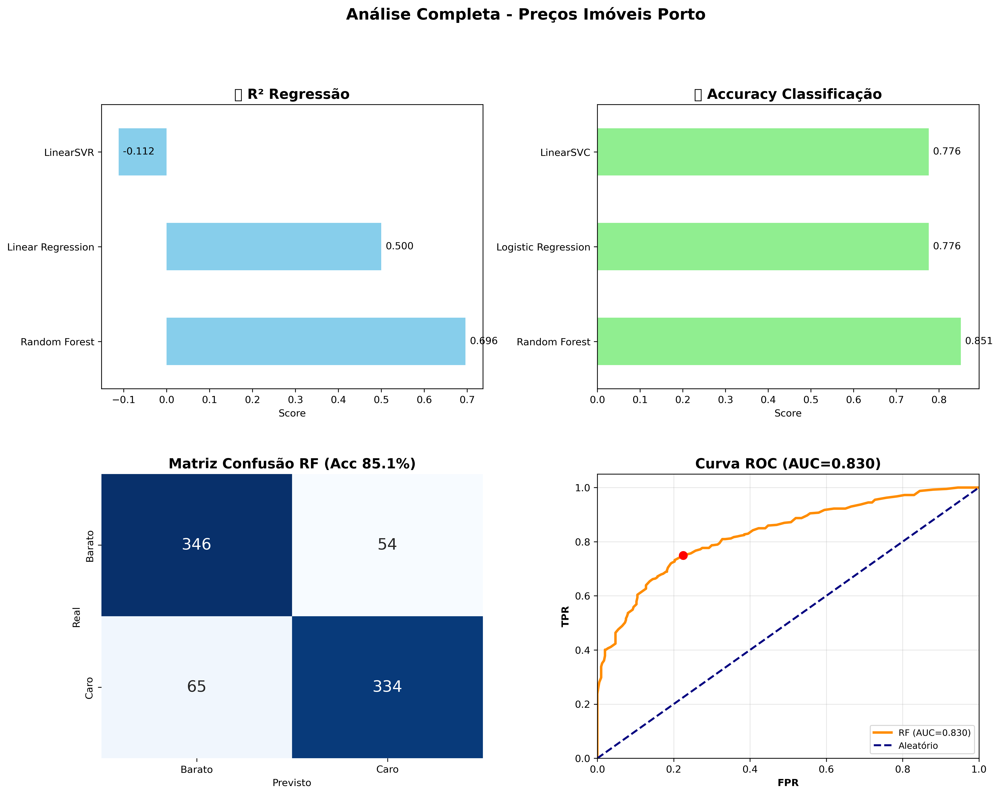
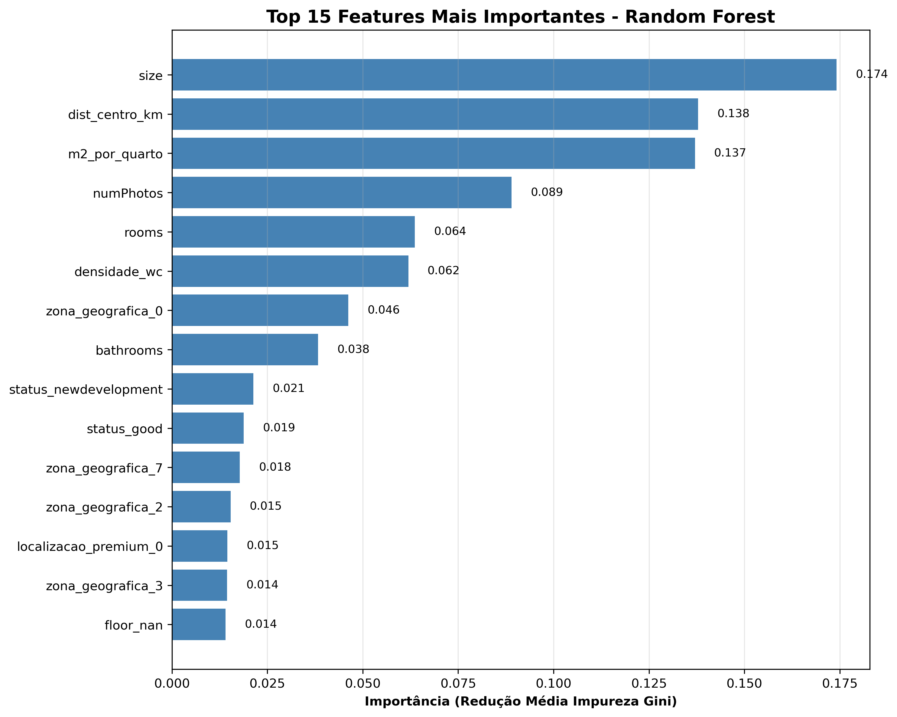
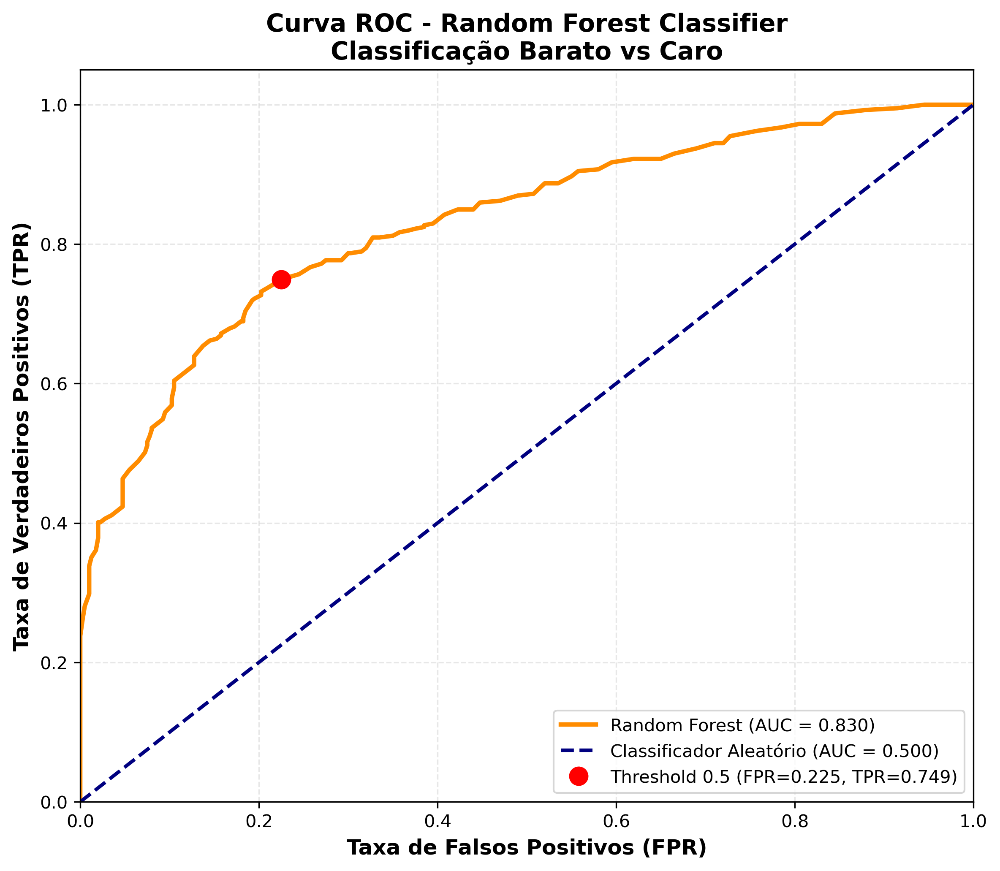
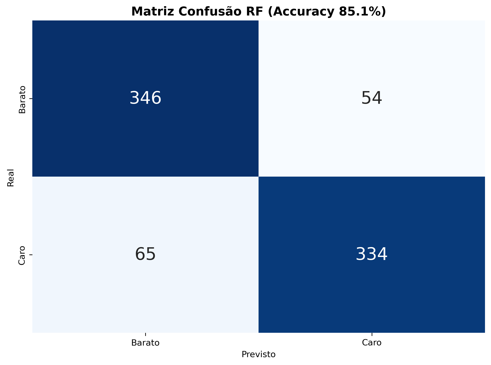
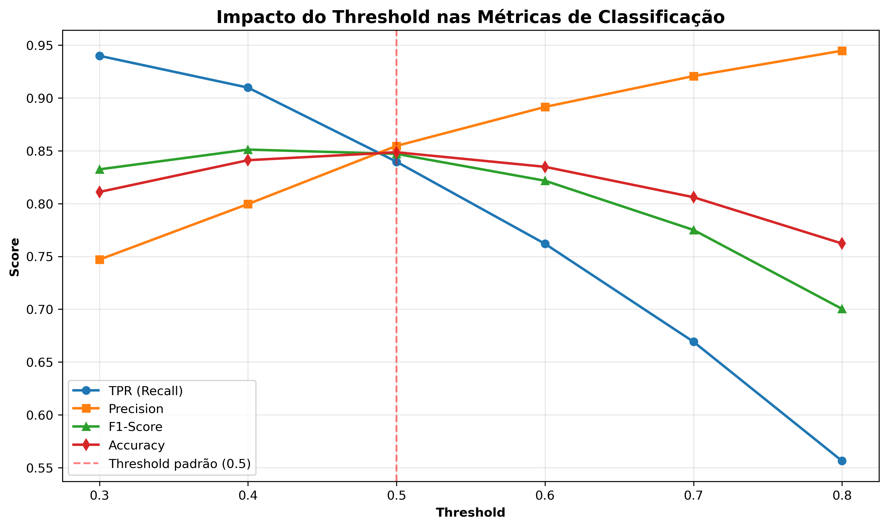
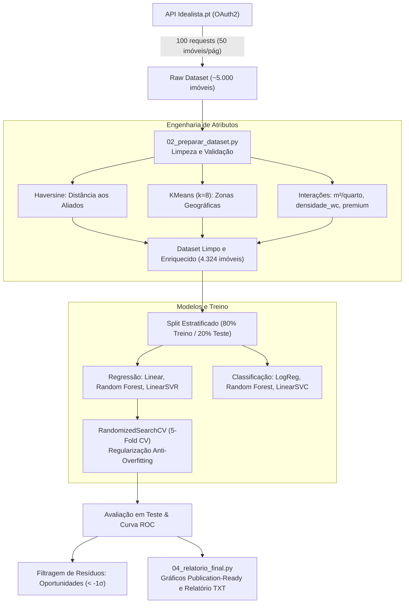

# 🏡 Previsão e Classificação de Preços de Imóveis no Porto (Idealista.pt)

<div align="center">

[](https://www.python.org/)
[](https://scikit-learn.org/)
[](https://pandas.pydata.org/)
[](LICENSE)
[](Relat%C3%B3rio_IA.pdf)

**Projeto Prático de Machine Learning — Inteligência Artificial (2025/2026)**  
*Engenharia Informática — ISLA Gaia*

[Visão Geral](#-visão-geral) • [Destaques](#-destaques-e-métricas) • [Visualizações](#-painel-e-visualizações) • [Metodologia & Pipeline](#-metodologia-e-pipeline) • [Resultados](#-resultados-comparativos) • [Oportunidades de Investimento](#-detetor-de-oportunidades-de-investimento) • [Como Executar](#-como-executar) • [Estrutura](#-estrutura-do-repositório)

</div>

---

## 📋 Visão Geral

Este repositório contém um pipeline analítico e preditivo completo para o mercado imobiliário do **Porto e arredores (raio de 7 km)**, com base em dados recolhidos diretamente da **API oficial do Idealista.pt (v3.5 via OAuth2)**.

O projeto resolve dois problemas fundamentais de Machine Learning:
1. **Regressão Contínua:** Estimar o valor de mercado por metro quadrado (€/m²) a partir de caraterísticas físicas, espaciais e do anúncio.
2. **Classificação Binária:** Classificar os imóveis como **"Barato"** (abaixo da mediana) ou **"Caro"** (acima da mediana), com calibragem de limiares de decisão de acordo com o perfil de risco do investidor.
3. **Deteção de Anomalias de Mercado:** Identificar sistematicamente imóveis com preço significativamente inferior à estimativa do modelo (resíduos estatisticamente significativos além de $1\sigma$), revelando potenciais oportunidades de investimento.

---

## ⚡ Destaques e Métricas

| Dimensão | Melhor Modelo | Métrica Principal | Validação Cruzada (5-Fold) | Métrica de Erro |
| :--- | :--- | :--- | :--- | :--- |
| **Regressão (€/m²)** | **Random Forest Regularizado** | **$R^2 = 0.667$** (Teste) | **$R^2_{CV} = 0.579$** | **$\text{MAE} = 566 €/\text{m}^2$** ($\text{RMSE} = 792 €$) |
| **Classificação (Barato vs Caro)** | **Random Forest Classifier** | **$\text{Acurácia} = 85.1\%$** | **$\text{AUC-ROC} = 0.927$** | **$\text{F1-Score} = 0.849$** |
| **Decisão de Alto Risco / Screening** | **RF (Threshold 0.3)** | **$\text{Recall} = 94.0\%$** | Captura 94%+ dos imóveis baratos | $\text{FPR} = 31.8\%$ |
| **Decisão Conservadora / Compra** | **RF (Threshold 0.8)** | **$\text{Precisão} = 94.5\%$** | Quase isento de falsos positivos | $\text{FPR} = 3.3\%$ |

---

## 📊 Painel e Visualizações

### Painel Geral de Resultados
O pipeline consolida os modelos de regressão, classificação, dispersão real vs. previsto e matriz de confusão:

<div align="center">
  
</div>

<br/>

### Importância de Atributos & Curva ROC
Identificação dos fatores mais determinantes na formação do preço e discriminação probabilística entre classes:

<div align="center">
  <table>
    <tr>
      <td width="50%" align="center"><b>Top 15 Features Mais Importantes (Gini)</b></td>
      <td width="50%" align="center"><b>Curva ROC e Ponto Operacional (AUC = 0.927)</b></td>
    </tr>
    <tr>
      <td></td>
      <td></td>
    </tr>
  </table>
</div>

<br/>

### Matriz de Confusão & Análise de Thresholds
Equilíbrio operacional entre recall (cobertura de oportunidades) e precisão (segurança do investimento):

<div align="center">
  <table>
    <tr>
      <td width="50%" align="center"><b>Matriz de Confusão (Acurácia: 85.1%)</b></td>
      <td width="50%" align="center"><b>Trade-off de Thresholds Operacionais</b></td>
    </tr>
    <tr>
      <td></td>
      <td></td>
    </tr>
  </table>
</div>

---

## 🏗️ Metodologia e Pipeline

O projeto foi estruturado em quatro etapas modulares, garantindo reprodutibilidade, validação estatística estrita e prevenção de *data leakage*:



### 🌍 Engenharia de Atributos Geográficos
- **Clustering Espacial KMeans ($k=8$):** A coluna nativa `neighborhood` continha ~87% de valores omissos na API. Foi aplicado agrupamento não supervisionado por latitude/longitude, segmentando o Grande Porto em 8 zonas homogéneas.
- **Distância Haversine:** Cálculo em quilómetros de cada imóvel até ao marco zero da cidade (Avenida dos Aliados — $41.1496^\circ\text{N}, -8.6109^\circ\text{W}$).
- **Localização Premium:** Indicador binário para imóveis a menos de 3 km do centro histórico.
- **Métricas de Densidade Habitacional:**
  - $\text{m2\_por\_quarto} = \frac{\text{size}}{\text{rooms} + 1}$
  - $\text{densidade\_wc} = \frac{\text{bathrooms}}{\text{rooms} + 1}$

---

## 📈 Resultados Comparativos

### 1. Modelos de Regressão (€/m²)

| Modelo | $R^2$ (Teste) | $R^2$ (CV 5-Fold) | $R^2$ (Treino) | RMSE (€/m²) | MAE (€/m²) | Desempenho |
| :--- | :---: | :---: | :---: | :---: | :---: | :--- |
| **Random Forest (Regularizado)** | **0.667** | **0.579** | 0.806 | **€792** | **€566** | 🏆 **Melhor Generalização** |
| **Linear Regression** | 0.500 | 0.421 | 0.464 | €971 | €736 | Linha de Base Linear |
| **LinearSVR** | -0.112 | -0.182 | -0.114 | €1.447 | €1.079 | Sensível a escala/dispersão |

> **Nota sobre Regularização:** O modelo base de Random Forest apresentava sobreajuste ($R^2$ treino $\approx 0.95$). Com a otimização de hiperparâmetros (`max_depth: 8-14`, `min_samples_split: 8-20`, `min_samples_leaf: 4-10`), obtivemos um ganho substancial de robustez em dados não vistos.

### 2. Modelos de Classificação (Barato vs. Caro)

| Modelo | Acurácia (Teste) | F1-Score | AUC-ROC | Matriz de Confusão (Teste) |
| :--- | :---: | :---: | :---: | :--- |
| **Random Forest Classifier** | **85.1%** | **0.849** | **0.927** | **346 VN** \| **54 FP** <br/> **65 FN** \| **334 VP** |
| **Logistic Regression** | 77.6% | 0.774 | ~0.84 | 308 VN \| 92 FP <br/> 93 FN \| 306 VP |
| **LinearSVC** | 77.6% | 0.774 | N/A | 307 VN \| 93 FP <br/> 93 FN \| 306 VP |

### 3. Matriz de Decisão por Threshold Operacional

| Threshold ($\theta$) | TPR (Recall) | FPR | Precisão | Acurácia | Recomendação Estratégica |
| :---: | :---: | :---: | :---: | :---: | :--- |
| **0.3** | **0.940** | 0.318 | 0.747 | 0.811 | 🔎 **Screening Automático:** Não perde oportunidades reais |
| **0.4** | 0.910 | 0.228 | 0.800 | 0.841 | ⚖️ **Filtro Equilibrado:** Boa precisão mantendo 91% de recall |
| **0.5** | 0.840 | 0.142 | 0.855 | **0.849** | 🎯 **Uso Geral:** Padrão ótimo balanceado |
| **0.6** | 0.762 | 0.092 | 0.891 | 0.835 | 💼 **Comitê de Investimento:** Menos de 10% falsos alarmes |
| **0.7** | 0.669 | 0.058 | 0.921 | 0.806 | 💎 **Alta Convicção:** 92% dos classificados são verdadeiramente baratos |
| **0.8** | 0.556 | **0.033** | **0.945** | 0.762 | 🛡️ **Aquisição Direta:** Máxima precisão (94.5%), falso alarme quase nulo |

---

## 💎 Detetor de Oportunidades de Investimento

Com recurso ao melhor modelo de regressão avaliado estritamente no **conjunto de teste (dados não vistos)**, calculou-se a distribuição dos resíduos:
$$\text{Resíduo} = y_{\text{real}} - \hat{y}_{\text{previsto}}$$

Foram isolados os imóveis com resíduo negativo superior a **1 desvio padrão ($\sigma_{\text{res}} \approx 790 €/\text{m}^2$)**, significando que o preço de listagem está substancialmente abaixo do valor justo de mercado previsto:

| # | Área | Tipologia | Dist. Centro | Preço Real (€/m²) | Preço Estimado (€/m²) | 💎 Poupança Estimada (€/m²) |
| :-: | :-: | :-: | :-: | :-: | :-: | :-: |
| 1 | 231 m² | T4 | 5.33 km | €3.247 | €6.057 | **+ €2.810 / m²** |
| 2 | 113 m² | T1 | 6.19 km | €2.212 | €4.638 | **+ €2.426 / m²** |
| 3 | 114 m² | T3 | 4.26 km | €3.202 | €5.362 | **+ €2.160 / m²** |
| 4 | 72 m² | Estúdio | 0.61 km | €3.278 | €5.171 | **+ €1.893 / m²** |
| 5 | 83 m² | T1 | 4.98 km | €3.193 | €4.918 | **+ €1.725 / m²** |

*(Extrato das 10 principais oportunidades guardadas em [`results/oportunidades_teste.csv`](results/oportunidades_teste.csv))*

---

## 📁 Estrutura do Repositório

```text
housing-market-ml-idealista/
│
├── .github/                         # Configurações do GitHub (opcional)
├── .env.example                     # Modelo para credenciais da API Idealista
├── .gitignore                       # Ignora ambientes virtuais, caches e ficheiros temp
├── LICENSE                          # Licença de código aberto MIT
├── README.md                        # Documentação técnica e apresentação do projeto
├── Relatório_IA.pdf                 # Relatório académico formal submetido ao ISLA
├── requirements.txt                 # Dependências do projeto com versões controladas
│
├── api documentation/               # Especificações oficiais da API Idealista
│   ├── oauth2-documentation.pdf     # Fluxo de autenticação OAuth2
│   └── property-search-api-v3_5.pdf # Endpoints de pesquisa de imóveis
│
├── datasets/
│   └── porto_imoveis_dataset.csv    # Dataset processado e limpo (4.324 imóveis)
│
├── src/
│   ├── 01_criar_dataset.py          # Recolha automatizada via API com paginação
│   ├── 02_preparar_dataset.py       # Limpeza, remoção de outliers e feature engineering
│   ├── 03_regressao_precos.py       # Pipeline de treino, CV, otimização e oportunidades
│   └── 04_relatorio_final.py        # Geração do relatório consolidado e gráficos
│
└── results/
    ├── ARVORE_RF_INDIVIDUAL.png     # Visualização de árvore individual do ensemble
    ├── CURVA_ROC.png                # Curva ROC do classificador Random Forest
    ├── FEATURE_IMPORTANCE.png       # Ranking de relevância dos atributos
    ├── MATRIZ_CONFUSAO.png          # Heatmap da matriz de confusão
    ├── PAINEL_COMPLETO.png          # Painel comparativo de 4 quadrantes
    ├── RELATORIO_GRAFICO_FINAL.png  # Gráfico comparativo de métricas
    ├── THRESHOLD_ANALYSIS.png       # Trade-off precisão/recall por threshold
    ├── resultados_completos.png     # Gráfico 4-em-1 gerado pelo script 03
    ├── RELATORIO_FINAL_PRECOS_PORTO.txt # Relatório textual estruturado
    ├── comparison.csv               # Tabela de métricas dos modelos de regressão
    ├── classification.csv           # Tabela de métricas dos modelos de classificação
    ├── threshold_analysis_rf_class.csv # Dados tabulares de análise de threshold
    └── oportunidades_teste.csv      # Top imóveis subvalorizados detetados
```

---

## 🚀 Como Executar

### 1. Pré-requisitos
- Python 3.10 ou superior
- Git instalado

### 2. Clonar o Repositório e Criar Ambiente Virtual

```bash
# Clonar repositório
git clone https://github.com/DFRSfx/housing-market-ml-idealista.git
cd housing-market-ml-idealista

# Criar e ativar ambiente virtual
python -m venv .venv

# Windows (PowerShell)
.venv\Scripts\Activate.ps1

# Linux / macOS
source .venv/bin/activate
```

### 3. Instalar Dependências

```bash
pip install --upgrade pip
pip install -r requirements.txt
```

### 4. Executar os Scripts

Os scripts contam com resolução de caminhos autónoma, podendo ser executados diretamente a partir da raiz do repositório ou da pasta `src/`:

```bash
# Opção Rápida: Usar o dataset já incluído (não requer chaves de API)
python src/02_preparar_dataset.py
python src/03_regressao_precos.py
python src/04_relatorio_final.py
```

> **Deseja recolher novos dados da API?**
> 1. Copie `.env.example` para `.env`:
>    ```bash
>    cp .env.example .env
>    ```
> 2. Preencha `IDEALISTA_API_KEY` e `IDEALISTA_SECRET` com as suas credenciais.
> 3. Execute:
>    ```bash
>    python src/01_criar_dataset.py
>    ```

---

## 🔮 Trabalho Futuro

- [ ] **Modelos de Boosting:** Experimentação com XGBoost, LightGBM e CatBoost visando $R^2 > 0.70$.
- [ ] **Pontos de Interesse (POIs):** Integração com OpenStreetMap para calcular proximidade a estações de metro (STCP/Metro do Porto), hospitais, escolas e praias.
- [ ] **Dashboard Interativo:** Criação de aplicação web em Streamlit para simulação de valor de imóveis em tempo real.
- [ ] **Séries Temporais:** Monitorização longitudinal da evolução de preços trimestrais por freguesia.

---

## 📚 Referências e Bibliografia

1. **Idealista.pt Developers:** *Property Search API v3.5 & OAuth2 Specification* (2025/2026).
2. **Pedregosa, F. et al.:** *Scikit-learn: Machine Learning in Python*, JMLR 12, pp. 2825-2830 (2011).
3. **Breiman, L.:** *Random Forests*, Machine Learning 45(1), 5-32 (2001).
4. **Documentação Académica:** Consulte o [Relatório Formal em PDF](Relat%C3%B3rio_IA.pdf) para a formulação matemática completa e fundamentação teórica.

---

## 👥 Autor

**Dário Soares** (a22307370)  
Licenciatura em Engenharia Informática — **ISLA - Instituto Politécnico de Gestão e Tecnologia**  
Unidade Curricular: *Inteligência Artificial (2025/2026)*

---

## 📄 Licença

Este projeto está distribuído sob a licença **MIT**. Consulte o ficheiro [LICENSE](LICENSE) para mais detalhes.